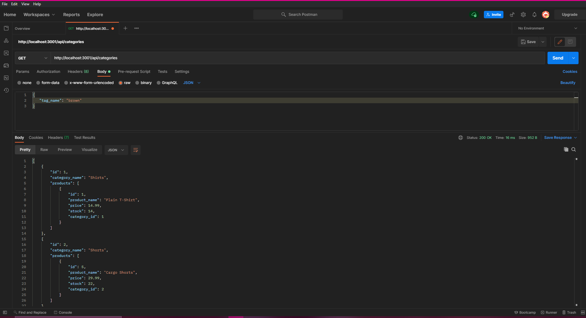

# eCommerce App Back End
  ## Table of Contents
  - [Description](#description)
  - [Installation Instructions](#installation-instructions)
  - [Usage Information](#usage-information)
  - [Demo Video](#demo-video)

  ## Description
  This is the back end of an eCommerce App, featuring databases built using MySQL and Sequelize, and servers using Express.

  ## Installation Instructions
  App requires VS Code, MySQL Workbench, and an API Development application like Postman or Insomnia. Node modules Express, MySQL2, and Sequelize are also required. Download the repository files from GitHub, open with VS Code, and install the required Node modules. 

  ## Usage Information
  Run the schema.sql file in MySQL Workbench, and use the command line to seed some starter data, if desired. Open the server in your API development app of choice and use the provided routes to navigate the database.

  ## Demo Video
  A video demo for this project can be found [here](https://drive.google.com/file/d/1dIliYuioxSpWRcz-wJfyqgYLTEJ_USf7/view).

